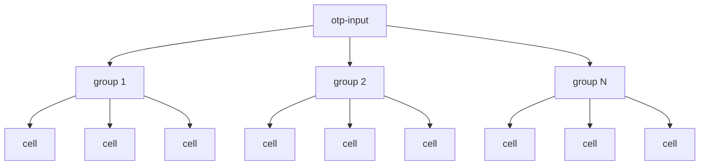

# 🚧 UNDER DEVELOPMENT 🚧

# @parabolabs/otp-input

Angular component for entering one time passwords built with modern Angular features (signals, zoneless change detection, new control flow syntax).

## Features

- accessibility out of the box
- zero dependencies
- high performance (`ChangeDetectionStrategy.OnPush` + signals)
- customizability
- handles paste event
- support for the Angular Forms API (implements `ControlValueAccessor`)
- core functionality is covered by unit tests

## Installation

```bash
npm i @parabolabs/otp-input
```

## Built-in behavior

- The first empty cell is focused or if all values are filled - the last cell.
- Focus moves to the next empty cell after a value was entered.
- When focus is on the last cell, pressing a key will update its value.
- When focus is on a cell with value, pressing delete will delete the value and keep focus in the cell.
- By default only digits are allowed to be entered. Can be changed via the `pattern` input (see examples).
- You can use the arrow keys to move backwards and forwards inside the cells - however, the rightmost allowed cell is always the first empty one.
- You can delete a filled cell's value at any position (using the arrow keys).
- Pasting replaces everything that's already been entered by the user.
- Pasting only works if all the characters in the pasted text are validated by the `pattern` regular expression.

## How to use

The following diagram demonstrates the expected structure of the component:



The component allows customizations via CSS custom properties and custom `ng-template`s for its cells.

You can provide any of the following to change the default styling (if not using a custom template):

```text
// cell
--otp-input-cell-font-family
--otp-input-cell-font-size
--otp-input-cell-color
--otp-input-cell-width
--otp-input-cell-height
--otp-input-cell-border-width
--otp-input-cell-border-color
--otp-input-cell-border-radius
--otp-input-cell-padding
--otp-input-cell-focus-outline-color
--otp-input-cell-focus-outline-width
--otp-input-cell-background

// carret
--otp-input-caret-width
--otp-input-caret-height
--otp-input-caret-color
--otp-input-caret-animation-duration
```

> [!TIP]
> You should use as many of these to make the component match your project's styling preferences.

### Single Input Group

```ts
import {
  OtpInputComponent,
  OtpInputGroupComponent
} from '@parabolabs/otp-input';

@Component({
  selector: 'my-component',
  standalone: true,
  imports: [
    OtpInputComponent,
    OtpInputGroupComponent,
    ...
  ],
  ...
})
```

```html
<!-- template -->
<prbl-otp-input [codeLength]="6" [formControl]="otpFormControl">
  <prbl-otp-input-group [cells]="6" />
</prbl-otp-input>
```

### Multiple Input Groups

```html
<!-- template -->
<prbl-otp-input [codeLength]="8" [formControl]="otpFormControl">
  <prbl-otp-input-group [cells]="4" />
  <span class="separator" aria-hidden="true"></span>
  <prbl-otp-input-group [cells]="4" [cellStartIndex]="4" />
</prbl-otp-input>
```

### Custom pattern

You can use one of the patterns provided by the library (`OTP_INPUT_DIGIT_REGEXP` - default and `OTP_INPUT_ALPHANUMERIC_REGEXP`) or provide your own.

```html
<!-- template -->
<prbl-otp-input [codeLength]="8" [pattern]="my_custom_regex">
  <prbl-otp-input-group [cells]="4" />
  <span class="separator" aria-hidden="true"></span>
  <prbl-otp-input-group [cells]="4" [cellStartIndex]="4" />
</prbl-otp-input>
```

### Custom Input Cell Template

You can provide your own custom `ng-template` that will be rendered for each input cell.


> [!NOTE]
> This is the most powerful and probably most useful feature of this library - you can make the input cells match your project's UI/UX design.

> [!WARNING]
> Too keep the component accessible, do not use an `input` (or interactive HTML elements) in the cell's content - all the needed events are already handled by the underlying `input` element inside `prbl-otp-input`.

You can even provide your own caret element, use the built-in one `<prbl-otp-input-caret />` or not show a caret at all.

```ts
import {
  OtpInputComponent,
  OtpInputGroupComponent
} from '@parabolabs/otp-input';

@Component({
  selector: 'my-component',
  standalone: true,
  imports: [
    OtpInputComponent,
    OtpInputGroupComponent,
    OtpInputCaret,
    ...
  ],
  ...
})
```

```html
<!-- template -->
<prbl-otp-input [codeLength]="6" [formControl]="otpFormControl">
  <prbl-otp-input-group [cells]="3" [cellTemplate]="customCell" />
  <ng-container [ngTemplateOutlet]="separator" />
  <prbl-otp-input-group [cells]="3" [cellStartIndex]="3" [cellTemplate]="customCell" />

  <ng-template #separator>
    <span class="separator-2" aria-hidden="true"></span>
  </ng-template>

  <!-- custom template -->
  <ng-template #customCell let-index="index" let-isSelected="isSelected" let-symbol="symbol">
    <div class="custom-otp-cell" [class.selected]="isSelected" aria-hidden="true">
      <ng-container *ngIf="symbol">{{ symbol }}</ng-container>
      <ng-container *ngIf="!symbol && isSelected">
        <prbl-otp-input-caret />
        <!-- you can also provide your own caret -->
      </ng-container>
    </div>
  </ng-template>
</prbl-otp-input>
```

The template receives the following context:

```ts
export interface OtpInputTemplateRefContext {
  index: number;
  isSelected: boolean;
  symbol: string | undefined;
}
```

## Component API

### `prbl-otp-input`

| Input        | Type      | Required | Description                                            |
|--------------|-----------|:--------:|--------------------------------------------------------|
| `codeLength` | `number`  | ✔️        | The length of the OTP code                             |
| `pattern`    | `RegExp`  | ✖️        | Regular expression which validates each entered symbol |
| `label`      | `string`  | ✖️        | `aria-label` for the input                             |
| `id`         | `string`  | ✖️        | `id` for the input                                     |
| `disabled`   | `boolean` | ✖️        | Whether the input is disabled                          |

### `prbl-otp-input-group`

| Input            | Type          | Required | Description                                                   |
|------------------|---------------|:--------:|---------------------------------------------------------------|
| `cellStartIndex` | `number`      | ✖️        | The starting index for the first cell in the group.           |
| `cellTemplate`   | `TemplateRef` | ✖️        | `<ng-template>` instance which will be rendered for each cell |
